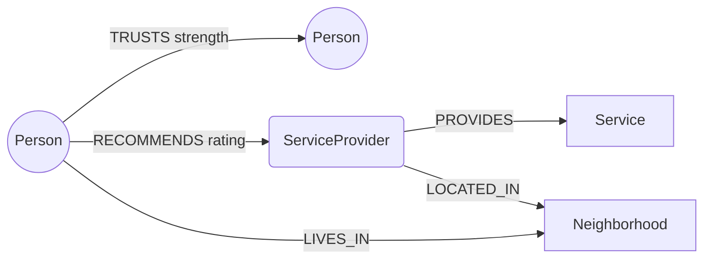
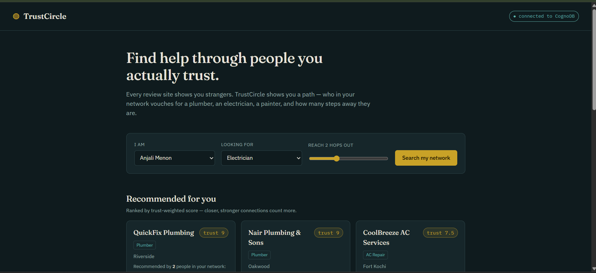
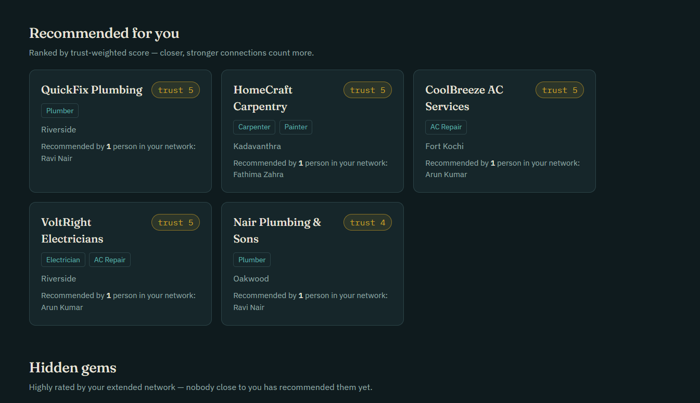
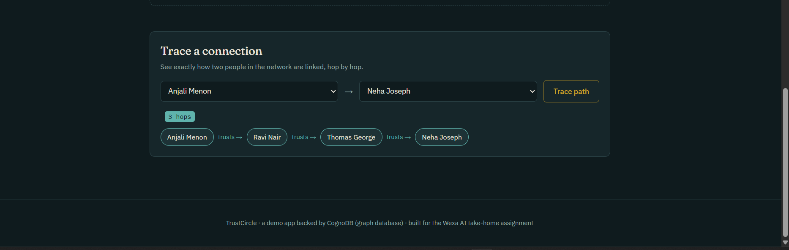

# TrustCircle

**Live demo:** https://trustcircle-j50s.onrender.com

Find trustworthy local service providers (plumbers, electricians, painters…) through your
own social trust network, ranked by *who* recommends them and *how close* that person is to you —
not by an anonymous star average.

Built for the Wexa AI take-home assignment, backed by **CognoDB** (openCypher over Bolt).


---

## Why a graph database?

The core question this app answers is: *"of the people I trust, and the people **they**
trust, who has actually used a good plumber?"* That's a variable-depth traversal query —
you don't know in advance whether the answer is one hop away or four, and you want the
*path* back (who vouched for whom), not just a yes/no.

In a relational schema, `TRUSTS` and `RECOMMENDS` would be junction tables, and answering
"anyone within 3 hops" means either:
- a fixed number of self-joins per hop depth (brittle — add a hop, add a join), or
- a recursive CTE that has to manually track visited nodes, depth, and accumulate a
  path-dependent score — most SQL engines make this verbose and slow past a couple of hops.

In Cypher it's one pattern: `(me)-[:TRUSTS*1..3]->(truster)-[:RECOMMENDS]->(provider)`.
The trust-weighted ranking (§ Query 1), the shortest-path trace between two people (§ Query 2),
and the "recommended by my extended network but not my direct one" query (§ Query 3) are all
natural graph-native asks and genuinely awkward to express and *execute efficiently* in SQL —
each would need its own bespoke recursive query, and performance degrades fast as hop depth grows
because every extra hop is another self-join across the whole table.

## Data model

```
 (:Person {id, name})
     │  LIVES_IN
     ▼
 (:Neighborhood {name})

 (:Person)-[:TRUSTS {strength: 1-5}]->(:Person)          -- directed, weighted social trust
 (:Person)-[:RECOMMENDS {rating: 1-5}]->(:ServiceProvider) -- a real usage + rating

 (:ServiceProvider {id, name})
     │  PROVIDES               │  LOCATED_IN
     ▼                         ▼
 (:Service {name})       (:Neighborhood {name})
```



Labels: `Person`, `ServiceProvider`, `Service`, `Neighborhood`.
Relationship types: `TRUSTS` (Person→Person, `strength` 1-5), `RECOMMENDS`
(Person→ServiceProvider, `rating` 1-5), `PROVIDES` (ServiceProvider→Service),
`LOCATED_IN` / `LIVES_IN` (→Neighborhood).

## The three main queries

All three live in [`routes/api.js`](routes/api.js), fully commented, parameterised via the
official `neo4j-driver` (no string concatenation anywhere).

1. **`GET /api/recommendations`** — multi-hop, trust-weighted ranking. Walks `TRUSTS*1..N`
   out from you, collects every `RECOMMENDS` edge reachable at each hop, and scores each
   provider by `Σ (rating / hop distance)` — closer recommendations count more. This is the
   2+-hop traversal requirement, and it's the query a relational DB would find awkward
   (variable-depth path + per-path distance-weighted aggregation).
2. **`GET /api/trust-path`** — `shortestPath((a)-[:TRUSTS*..6]->(b))`. Traces exactly how
   two people are connected and returns the chain of names. Unbounded shortest-path search
   like this needs a dedicated algorithm in SQL-land; it's a one-liner in Cypher.
3. **`GET /api/hidden-gems`** — providers rated ≥4★ by your *2nd-degree* trust network that
   nobody in your *direct* circle has recommended yet. A second-degree-only filter
   (`NOT (direct)-[:RECOMMENDS]->(provider)`) is another pattern that reads naturally as a
   graph anti-join but is fiddly in SQL.

## Project structure

```
trustcircle/
├── server.js          # Express entrypoint, health check, static file serving
├── db.js              # CognoDB/Neo4j driver, connection verification, query runner
├── routes/api.js       # All REST endpoints + the Cypher queries themselves
├── seed/seed.js        # Loads sample people/providers/trust/recommendation graph
├── public/             # Vanilla HTML/CSS/JS frontend (no build step)
│   ├── index.html
│   ├── style.css
│   └── app.js
├── .env.example
└── package.json
```

## Setup & run

### 1. Create your CognoDB instance
1. Sign up at https://console.cognodb.com/signup (free, no card).
2. Create a free **c0** instance, pick a region, wait ~1 minute.
3. Copy the `bolt+s://...` URI and the generated password for user `cognodb` —
   the password is shown once.

### 2. Configure the app
```bash
cp .env.example .env
# edit .env and paste in your COGNODB_URI and COGNODB_PASSWORD
```

### 3. Install & seed
```bash
npm install
npm run seed        # loads ~12 people, 10 providers, trust + recommendation edges
```
You should see a per-label node count printed at the end, e.g.:
```
Seed complete. Node counts:
  Neighborhood: 5
  Person: 12
  Service: 7
  ServiceProvider: 10
```

### 4. Run it
```bash
npm start
# -> TrustCircle running on http://localhost:3000
# -> ✔ Connected to CognoDB
```
Open http://localhost:3000. The top-right badge shows live DB connection status.

### 5. What "working" looks like
- Pick a person (e.g. "Anjali Menon"), leave service as "Any", hit **Search my network** →
  the *Recommended for you* grid fills with providers, each showing a trust score and who
  vouched for them.
- Drag the hops slider down to 1 and search again → fewer/no results, since fewer people
  are in reach — this demonstrates the multi-hop behavior directly.
- Scroll to **Trace a connection**, pick two different people, hit **Trace path** → a chain
  of name-bubbles linked by "trusts →" showing the actual shortest path between them.
- Stop the app, rename `.env` temporarily, restart → the DB badge turns red
  ("database unreachable") and API calls return a clean 503 instead of crashing — this is
  the graceful-error-handling requirement in action.

## Deploying a demo

Any free Node host works (Render, Railway, Fly.io). General shape:
1. Push this repo to GitHub.
2. Create a new Web Service pointed at the repo, build command `npm install`, start
   command `npm start`.
3. Add `COGNODB_URI`, `COGNODB_USER`, `COGNODB_PASSWORD` as environment variables in the
   host's dashboard (never in the repo).
4. Deploy, then run `npm run seed` once against the same `.env` values (locally, pointed
   at the same CognoDB instance) so the hosted app has data to show.

## Screenshots




